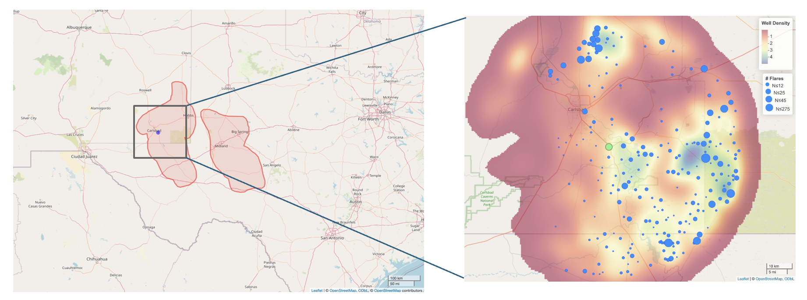
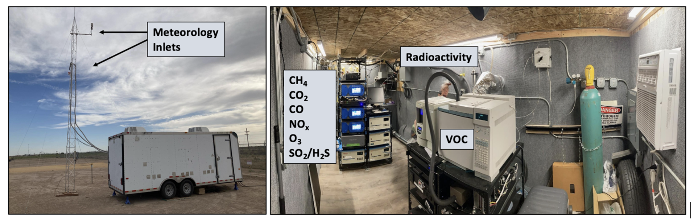

## Assessing Source Contributions to Air Quality and Noise in Unconventional Oil Shale Plays

### Overview
This repository contains data and code for analyzing source contributions to air pollution and noise in the Permian Basin, one of the most active unconventional oil and gas production regions in the world. Specifically, it supports a year-long (May 2023 through May 2024) ambient monitoring campaign conducted in Loving, New Mexico (LNM) situated in the Delaware sub-basin of the Permian.

*Figure 1. Map showing the Permian basin and location of the monitoring site in Loving, New Mexico (green dot), with well density (heatmap) and VIIRS satellite-detected flares (blue dots).*

The monitoring campaign was designed to quantify the influence of different unconventional oil and gas development (UOGD) activities such as flaring, venting, combustion, traffic, and produced water ponds on local air quality and noise pollution. 

### Data
The data collected at LNM includes continuous, high temporal resolution measurements of:
- Ambient air pollutants and greenhouse gases, including nitrogen oxides (NO, NO2), sulfur dioxide (SO2), hydrogen sulfide (H2S), methane (CH4), carbon dioxide (CO2), carbon monoxide (CO), radon, particle radioactivity, 20 speciated volatile organic compounds (VOCs).
- Meteorology, including temperature, humidity, wind speed, wind direction.
- Noise, 1/3 octave frequency bands and weighted sound pressure levels in decibels (dB).

All data followed strict quality control and quality assurance protocols. Additional information about the data collection and QA/QC methods can be found at [Boulder Air](https://www.bouldair.com/loving.htm)

*Figure 2. Outside and inside the LNM sampling trailer.*

### Supplemental data
- Satellite-detected flares from the Visible Imaging Spectroradiometer (VIIRS) [Nightfire](https://eogdata.mines.edu/products/vnf/).
- Well locations and monthly production values from [Enverus](https://www.enverus.com/) (only available for download from Enverus with subscription). 

### Acknowledgement
The data were collected and research was conducted under contract to the Health Effects Institute (HEI), an organization jointly funded by the United States Environmental Protection Agency (EPA) (Contract No. 68HERC19D0010) and certain oil and natural gas companies. Although the research was produced with partial funding by EPA and industry, they have not been subject to their review, and therefore the research does not necessarily reflect the views of the Agency or the oil and natural gas industry, and no official endorsement by the Agency or the industry should be inferred.
